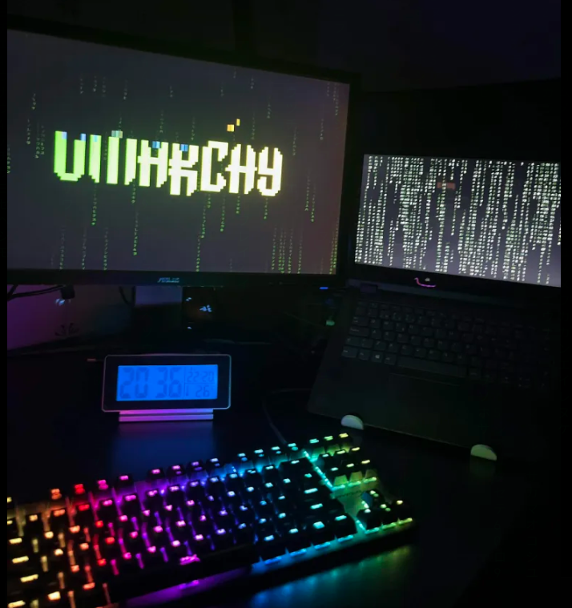

# Omarchy Matrix Theme

A green-on-black [Omarchy](https://omarchy.org/) theme, plus an optional
matrix-rain wallpaper and idle-fading terminals.





## Install (theme only)

```bash
omarchy theme install https://github.com/tmp75/omarchy-matrix-theme.git
```

This clones straight into `~/.config/omarchy/themes/matrix` and applies it.
Covers colors, icons, Neovim, VS Code, and two 3840×2160 backgrounds.

## Install (theme + matrix-rain extras)

The extras are optional and off by default outside this theme. They add:

- **Animated digital rain** on the wallpaper layer (a `Canvas` in a cloned
  `background` plugin), active only while the "matrix" theme is selected.
- **Idle-fading kitty terminals** — background cells fade to let the rain
  show through once a terminal has been unfocused, unhovered, and quiet
  (title settled) for a while. Text stays fully opaque throughout; only the
  empty cell background fades. A live agent prompt that keeps updating the
  window title is treated as busy and never fades.

```bash
omarchy theme install https://github.com/tmp75/omarchy-matrix-theme.git
cd ~/.config/omarchy/themes/matrix
./install-extras.sh
omarchy theme set matrix
omarchy restart shell
omarchy restart terminal
```

`install-extras.sh` clones the stock `omarchy.background` plugin (if you
haven't already), drops in the matrix-rain `Background.qml`, installs
`omarchy-matrix-idle-rain` to `~/.local/bin`, adds it to Hyprland's
autostart, and adds the three kitty.conf settings the watcher needs
(`allow_remote_control`, `listen_on`, `dynamic_background_opacity`). It only
appends — it won't touch anything already there.

Tune it with environment variables (set them before the autostart line in
`~/.config/hypr/autostart.lua`):

| Variable | Default | Meaning |
|---|---|---|
| `MATRIX_RAIN_IDLE_SECONDS` | `60` | Seconds of idle before a terminal fades |
| `MATRIX_RAIN_OPACITY` | `0.75` | Background opacity once faded |

## Uninstall extras

```bash
rm ~/.local/bin/omarchy-matrix-idle-rain
# remove the o.launch_on_start("omarchy-matrix-idle-rain") line from
# ~/.config/hypr/autostart.lua, and the three kitty.conf lines it added
omarchy plugin remove $USER.background
```

## Why a separate `install-extras.sh` instead of it all living in the theme?

Omarchy's own theme system only ever touches
`~/.config/omarchy/themes/<name>/` — colors, icons, editor configs,
backgrounds. It has no mechanism for a theme to install a shell plugin or
touch Hyprland/kitty config, and it shouldn't gain one just for this: a
`theme install` silently editing your `autostart.lua` would be a bad
surprise. The extras are a deliberate, visible, opt-in step instead.

## License

MIT — see [LICENSE](LICENSE).
